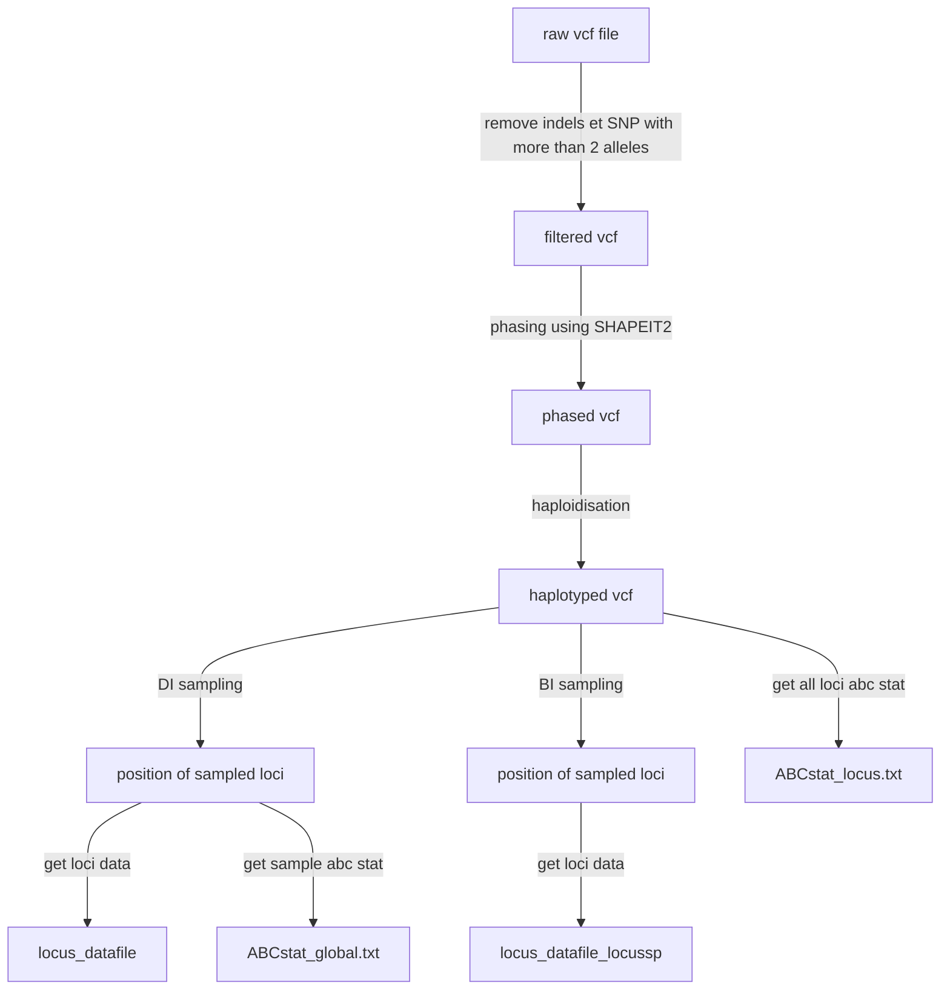
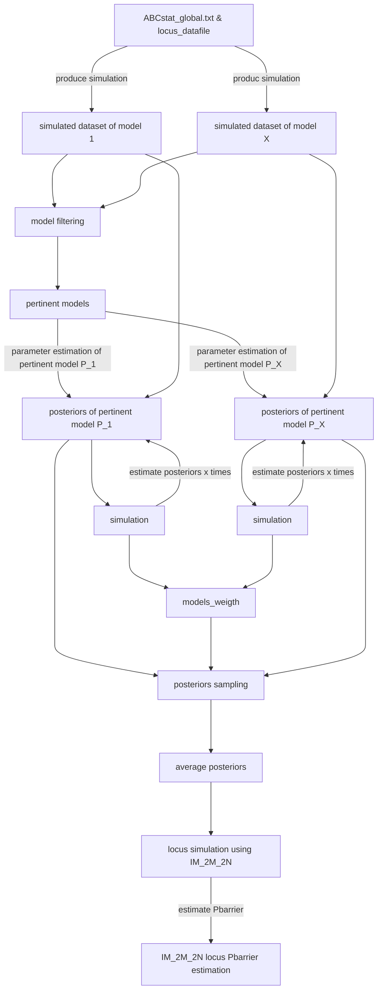
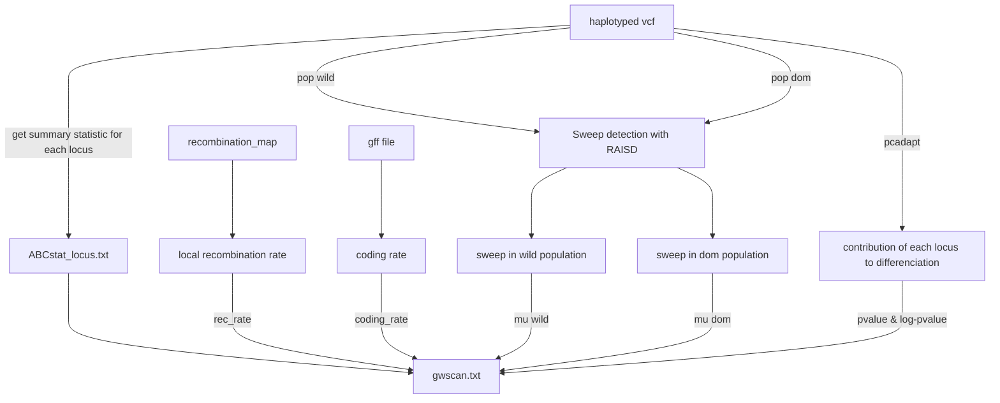
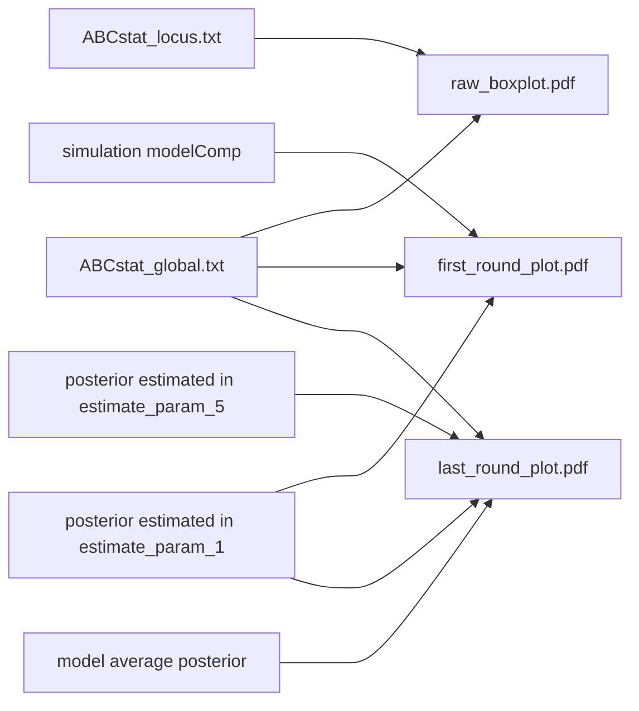

# Resume
RIDGE is divided in 4 parts : 
1. input part : it formats the input vcf file and generate a sample of X loci of N bp
2. core part : measure the probability of a locus to be a barrier locus
3. visualisation part : generate visual plot to control the core part correct work
4. gwscan part : generate genome wide analysis

## Configuration
Before running RIDGE, the user must define multiples parameters : 
- $\mu$ : 
- $window\_size$ : 
- $ligth\_mode$ : 
- $timeStamp$ :
- $nameA,nameB$
- 
- $Tsplit\_min,Tsplit\_max$
- $N\_min,N\_max$
- $M\_min,M\_max$
- 
## Input part
### Formating raw data
Before infering the gene flow barries, raw data must be treated, in order to be conform to RIDGE requirement and also to allow each dataset result to be comparable (detailed later). First, indels and SNP containing more than 2 alleles are removed using _bcftools_ (). Next, data are rephased with SHAPIT2 () to ensure that all haplotyped are phased. Phased data are haploidised, to allow comparition between selfer systems and outcrosser systems. Selfing, increase drasticly the homogeneity and reduce genetic diversity (Burgella & Glémin, 2017), and so when two diploid species -- one outcrosser and one selfer -- are compared, the outcrosser species posses two times more information than selfer species. To avoid this bias, RIDGE take only one of the two haplotypes.
### Sampling loci
To perform simulation and ABC inference, RIDGE use a subsample of the whole genome and make the hypothesis that the subsample is representativ from the rest of the genome. To generate the subsample, the whole genome is divided in window of $window\_size$ bp ($window\_ size$ is defined by the user). The user define the number of loci that are sample per chromosome. Once the subsample is defined, two files are generated : _locus_dataset_ ; _ABCstat_global.txt_. 
_locus_dataset_ contain basic information for each sampled loci -- the locus length ; the number of haplotype in population A and B and the sum of the two pop ; locus diversity $\theta$ as $\theta=4*N_{ref}*\mu*locus\_length$ ; locus number of recombination $\rho$ as $\rho = 4 * N_{ref}* r * locus\_length$. RIDGE make the hypothesis that $\mu$ is constant across genomo, but $r$ (recombination rate) is heterogeneous. To get local $r$ and so $\rho$, the user must provide a recombination map. The information contain in _locus_datafile_ will be use to simulate 
ABCstat_global.txt is the summary statistics of the subsample of loci (see[Summary statistics use in ABC process](RIDGE/Summary%20statistics%20use%20in%20ABC%20process.md) for details).
In addition to the first subsample generated for demographic inference

## core part

## gwscan

## visualisation 

