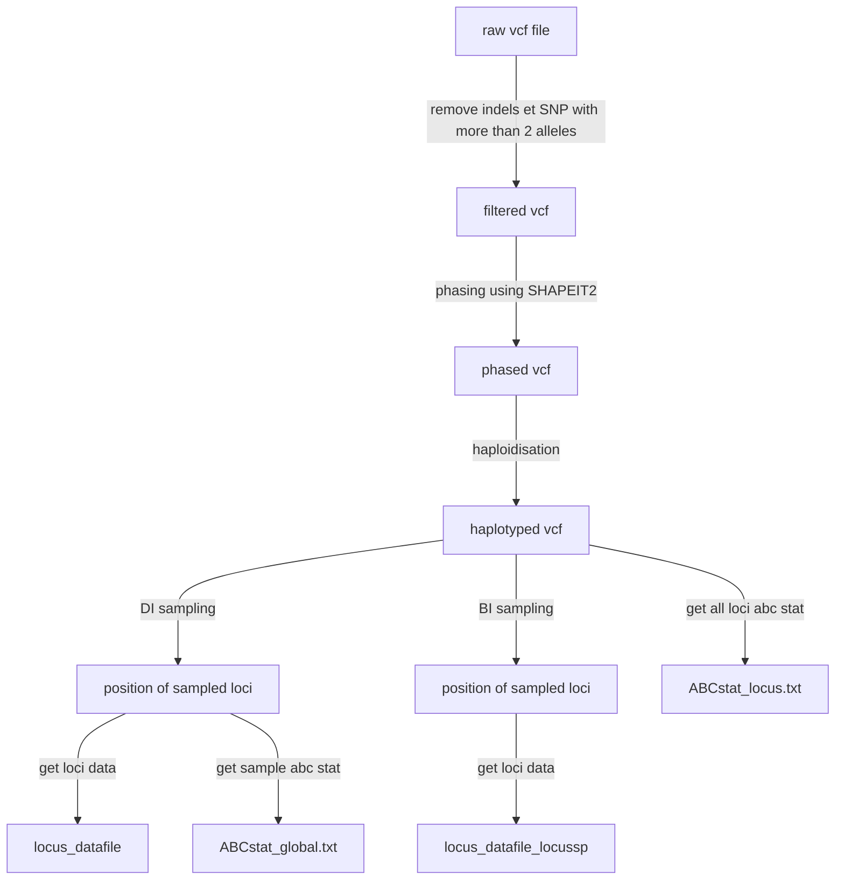
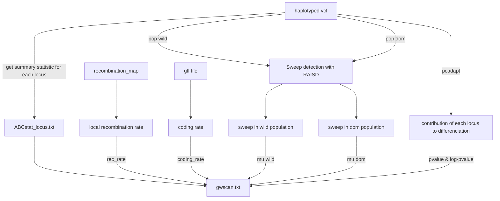
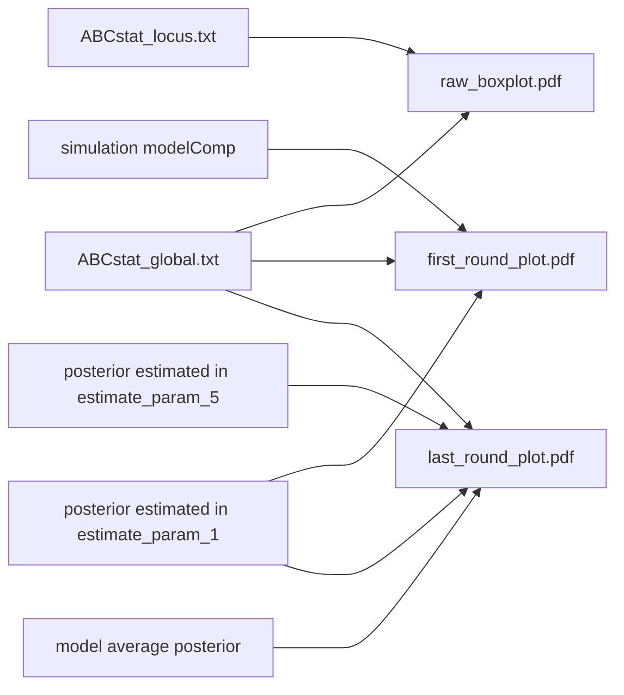

# Resume
RIDGE is divided in 4 parts : 
1. input part : it formats the input vcf file and generate a sample of X loci of N bp
2. core part : measure the probability of a locus to be a barrier locus
3. visualisation part : generate visual plot to control the core part correct work
4. gwscan part : generate genome wide analysis

## Configuration
Before running RIDGE, the user must define multiples parameters : 
- $\mu$ :  mutation rate per base
- $window\_size$ : size of loci (in bp)
- $ligth\_mode$ : activate ligth mode, which is faster and less accurate than default mode (TRUE or FALSE)
- $timeStamp$ : path to data
- $nameA,nameB$ :  name of populations used in popfile.csv ( A is the first population in popfile)
- $Tsplit\_min,Tsplit\_max$ : bounds of Tsplit values (in generation)
- $N\_min,N\_max$ : bounds of effective size 
- $M\_min,M\_max$ : bounds of migration rate (N.m)
- 
## Input part
### Formating raw data
Before infering the gene flow barries, raw data must be treated, in order to be conform to RIDGE requirement and also to allow each dataset result to be comparable (detailed later). First, indels and SNP containing more than 2 alleles are removed using _bcftools_ (). Next, data are rephased with SHAPIT2 () to ensure that all haplotyped are phased. Phased data are haploidised, to allow comparition between selfer systems and outcrosser systems. Selfing, increase drasticly the homogeneity and reduce genetic diversity (Burgella & Glémin, 2017), and so when two diploid species -- one outcrosser and one selfer -- are compared, the outcrosser species posses two times more information than selfer species. To avoid this bias, RIDGE take only one of the two haplotypes.
### Sampling loci
To perform simulation and ABC inference, RIDGE use a subsample of the whole genome and make the hypothesis that the subsample is representativ from the rest of the genome. To generate the subsample, the whole genome is divided in window of $window\_size$ bp ($window\_ size$ is defined by the user). The user define the number of loci that are sample per chromosome. Once the subsample is defined, two files are generated : _locus_dataset_ ; _ABCstat_global.txt_. 
_locus_dataset_ contain basic information for each sampled loci -- the locus length ; the number of haplotype in population A and B and the sum of the two pop ; locus diversity $\theta$ as $\theta=4*N_{ref}*\mu*locus\_length$ ; locus number of recombination $\rho$ as $\rho = 4 * N_{ref}* r * locus\_length$. RIDGE make the hypothesis that $\mu$ is constant across genomo, but $r$ (recombination rate) is heterogeneous. To get local $r$ and so $\rho$, the user must provide a recombination map. The information contain in _locus_datafile_ will be use to simulate 
ABCstat_global.txt is the summary statistics of the subsample of loci (see[Summary statistics use in ABC process](RIDGE/Summary%20statistics%20use%20in%20ABC%20process.md) for details). Also, summary statistics are calculated for every loci and stored in _ABCstat_locus.txt_.
In addition to the first subsample generated for demographic inference, a larger sample (x10 larger) is generated specificaly for the part where the locus specific simulations. The purpose of this sample is just to generate _locus_datafile_locussp_ file. 

## Core part
The core part aim to infer the proportion of barrier in genome and the putative position of each gene flow barrier loci. Because, the signature of a gene flow barrier depend of the demography, RIDGE firstly infer the demographic scenario before infering the $P_{barrier}$ of each locus. Demographic inference is ensured by a ABC method optimized by machine learning alghorithm (random forest from __abcrf__ package). At the beginning, simulation prior are uniformly drafted between bound defined by user following the describde method here :  [Generating simulation priors and proceed to simulation](RIDGE/Generating%20simulation%20priors%20and%20proceed%20to%20simulation.md). Simulation are runned under 14 different models as descrided here : [demographic models to work with ABC](RIDGE/demographic%20models%20to%20work%20with%20ABC.md) and each dataset are resume using the same ABC summary than used for the provided dataset (see [Summary statistics use in ABC process](RIDGE/Summary%20statistics%20use%20in%20ABC%20process.md)). After this first round of simulation, the contribution of each model in data explanation is estimated by random forest alghorithm. Only the models that are in 95% of the cumulative sum of models weigth are keept (named filtered models), the rest of models is rejected. Posterior of observed dataset are estimated using each filtered models simulation(see [Models Weights and Posteriors estimation](RIDGE/Models%20Weights%20and%20Posteriors%20estimation.md)). Then posteriors become simulation priors, simulation are run and posterior are estimated. This loop run $x$ times ($x=  1$ if ligthmodel is activated, else $x=5$), and make prior converge closer to observed data. From those optimized priors and simulation, the contribution of models is re-estimated (as described before) and used to sample posterior as sampling probability. Sampled posterior are merged inside _locus_posterior_mw.txt_ file, using some rules to concile different and potentialy incompatible models together (see [Posteriors averaging](RIDGE/Posteriors%20averaging.md)). From average posterior and _locus_datafile_locusssp_ locus specific simulation are generated (it means that rather having average summary statistics over thousands of loci, locus specific simulation give information for each locus) using an IM_2M_2N with half of loci simulated with migration and the other half as gene flow barrier (no migration).  With locus simulation, the probability of being a barrier of each obseved loci is estimated. Barrier probability is the number of tree that voted for barrier classe over all trees from the random forest trained with locus simulations. 
Because alone, the barrier probability is not very usefull, RIDGE evaluate his ability to detect barriers on the observed dataset through production of True and False positive rate for each threshold of Pbarr values [0,1], and the number of loci with a $Pbarr_i>threshold$. All those informations allow to the user to choose a pertinent threshold to define in his observed dataset, which loci is a barrier. himself and produce a roc curve. 

## gwscan

## visualisation 

