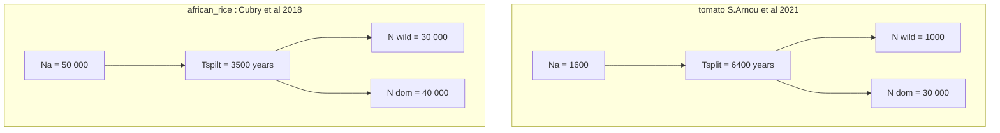
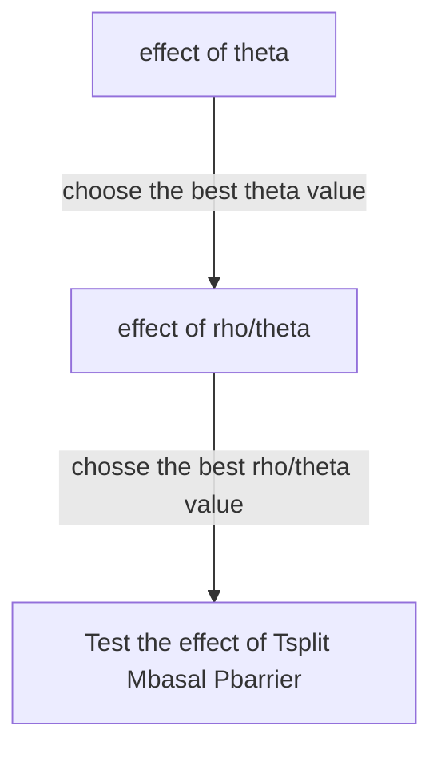

## Barrier inference (BI)
### Effect  of the number of round on BI
#### Data : 
simulated dataset (IM_2M_2N)
#### Method : 
use close prior ==see below==
run RIDGE using 1; 2; 3; 4; 5 rounds of estimation
	» first use 1 round and estimate BI
	» use a second round and estimate BI
If first round is enough stop,
Else add a round.
#### Evaluation : 
True roc curve
#### status : 
- modelcomp : running
- 
### effect of demographic parameters on BI
#### Data :
Dataset are simulated with the following parameters
model = IM_2M_2N

==utiliser un range  de prior restrint==
==TOUJOURS UTILISER LE MÊME N_REF==
non-variable parameter 

| param | value | 
|---|---|----|
| Na N1 N2 | 100 000| 
| beta a| 2.5|
| beta b | 2.5 |  
| nlocus|  10 000 (pour BI ,mais 1e3 pour DI)|
| rep | 10 (first and 100 laters if needed) | 

Variable parameters

| param | values |
| ---|---|
| Tsplit | 1000;1e4;1e5;5e5 | 
| Mbasal | 0.1,1,10 |
| Pbarrier | 1e-3; 5e-3 ;0.01; 5e-2 ;  0.1  |
| $\theta$ | peu poly vs poly ($\pi$=0.002 ; 0.02) | 
 | $\frac{\rho}{\theta}$ | allogame (20) vs autogame (200) | 
 

==LATER : use a pertinent sim to test rho sur thera==

#### Method and Evaluation
» Run RIDGE on each of them

» Generate the true ROC curve for each dataset (only feasable because we know the true position of each barrier)
»  Barrier inference performances are estimated through a ROC curve comparition in the differenct conditions
» identify how the parameters affect the barrier inference performances
 
source : [en.wikipedia.org/wiki/Receiver_operating_characteristic](https://en.wikipedia.org/wiki/Receiver_operating_characteristic)

---

### effect of coding rate on BI (nope)
#### Data :
real dataset (African Rice dataset)

#### Method  : 
Generate 4 samples of 1000 locis following the rules below :
| dataset | rule | 
|---|---|
| only conding | samples are exon only |
| only non-coding | samples aren’t in genes and in regions where coding rate is low (see dataset)|
| mix | a mix of 50-50 of coding and non-coding loci |
| random | take random loci in the genome | 

» run RIDGE DI on each of them in heavy mode 
#### Evaluation 
» compare the infered demography
» compare the expected performance ( roc curve )
» compare the barrier infered, where they are, consistancy with expected signal of barrier

## model inference and effect of model averaging on DI inference and BI (nope)
#### Data : 
African Rice dataset 
#### Method : 
Use RIDGE with and without model averaging (only the best model is keeped) + use DiLS (optional, depending on feasability)
#### Evaluation : 
» compare the estimated demography between conditions
» compare the barrier infered, where they are, consistancy with expected signal of barrier
## Demographic inference (DI) (nope)
### check the effect of $\rho$ and $\theta$ on DI
#### Data : 
Simulate $100000$ random dataset for each 14 model under the following parameters : 
| param | values |
| ---|---|
| $\theta$ | {20,50,100,150} | 
| $\frac{\rho}{\theta}$ (with $\theta$ = 20) | {5,50,100} |
Prior bound used to generate random datasets
|param| lower bound | higher bound |
| ---|---|---|
|Na , N1 , N2 | 1000 |1 000 000|
| M | 0 |50 |
| Tpslit | 1000|100 000|

#### Method : 
80% (==maybe to change==) of dataset will be used as training data, the rest (20%) serv as observe 
dataset. Observe dataset prior will be estimated by ridge in one round of inference (computation limits) . 
#### Evaluation :
Prior estimation error for each parameter, for each dataset, for each model will be estimated and compared between the 6 simulation conditions (probably through NMAE).

### check the ability to infere a defined demography
#### Data : 
Simulated dataset under 3 models : SI_1N ; SI_2N ; IM_2M_2N
rep number  = 100. Demography is fixed and the same for each replica.
| param | value |
|---|---|
| Tpspilt | 10000 | 
| Na N1 N2 | 50 000|
| beta a (SI_2N and IM )| 2.5|
| beta b (SI_2N an IM)| 2.5 |
| M (IM)| 10 |
| Pbarrier (IM) | 0.1
| $\theta$ | 20
| $\rho$ (depend of previous test)| 100
#### Method 
» run ridge of each of the dataset using only one round of inference (computational limits)
#### Evaluation 
» distance between mean estimation and priors for each model used and for each parameter in priors
