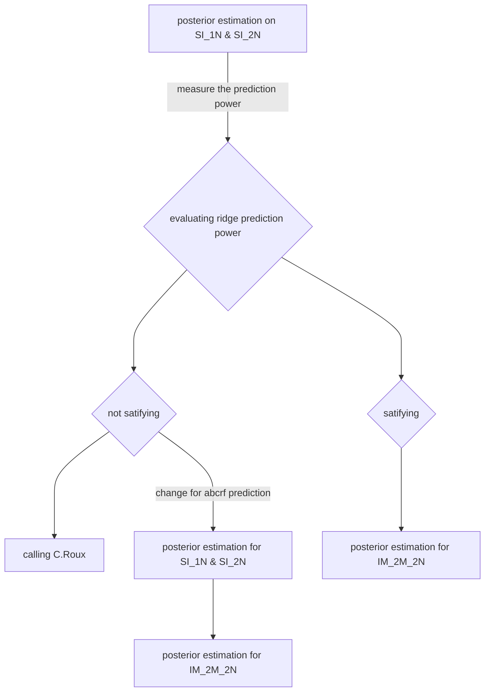

Tags : #Test
## Introduction
To estimate posterior, RIDGE use a script named : estimate_2pop_best.R, developed by C.Roux and modifyed by me. 
It mainly use a neural networt alghorithm from the package [nnet](https://cran.r-project.org/web/packages/nnet/index.html). Random forest from [[abcrf]]() were also used as a control. The main interest in using neural network is, it allows joint estimation of posterior, where random forest estimate each parameter separately.  

### Tests
We want to test the ability of estimate_2pop_best.R to estimate correctly the priors.
First we test for the simplest model (SI_1N and SI_2N, see [[demographic models to work with ABC]]), if estimate_2pop_best.R is able to 
get the parameter using simulated data from the same model used to generate the observed dataset
By default the priors used to generate the observed dataset are the following : 

|param|value|coalescent value|
|-----|-----|----|
|Tsplit| 10000 |0.0294|
|Na| 85000|1|
|N1| 85000|1|
|N2| 85000|1|
| $\mu$| 3e-8 | |
| $\frac{\rho}{\theta}$ | 5 ||
|locus length | 1000 bp|
In a second time, we want to caracterise the teh prediction power for model with migration and Ne heterogeneity (IM_2M_2N)

#### Plan of the test

#### Posterior estimation on SI_1N and SI_2N
For two models, a dataset of 1000 independent loci have been simulated. In other hand, the 4000 ABC datasets of 1000 loci were simulated for each models using the following prior bounds (in coalescent unit)
| param | lower bound | upper bound | ref value |
|--------|--------------|--------------| -------|
| Tsplit | 0.00294 | 0.058| 0.0294
| Na, N1, N2 | 0.1 | 2 | 1, 1, 1 |
| shape_N_a , shape_N_b | 0.1 | 5 | 4.36 , 1.77 |
posterior estiamition were done with 100 neural networks ( see why here [[Test performance estimation posterior#^598726]]) and in a second time with 1000 random trees from random forest to control if the results are dependant of the alghorithm. All the summary statistics where used (mode NULL [[Test performance estimation posterior#^4ab9d0]])
- Hypothesis 1 : Nnet does joint estimation, I expect it to have lower prediction power due to the cost of estimating all parameter at once. 
- Hypothesis 2 : SI_2N will be harder to predict than SI_1N, due to Ne heterogeneity 

##### Posterior estimation of SI_1N
![[SI_1N_posterior_estimation.jpg]]
**Fig 1** : *Posterior estimation of SI_1N model using nnet alghorithm (black line, mean = dashed line) and abcrf alghorithm (dashed blue line). The target value is the red solid line.*
The result show, similar performance for both of the algorithms based on their mean and the reference is always in the distribution of nnet posterior inference.  

##### Posterior estimation of SI_2N model

![[SI_2N_posterior_estimation.jpg]]
**Fig 2** : *Posterior estimation of SI_2N model. Legend is the same as Fig 1.* 

For the SI_2N model, the prediction power is lower than SI_1N (validate H2). Futhermore, the power of random forest seem significantly higher than nnet (validate H1 under H2). 
The beta shape parameter seems to be quite hard to predict. 

#### Contribution of each summary stats in estimation bias for SI_2N
##### rejection vs rejection + regression
Befole 
$D_S= \sqrt{\sum\limits_{I=1}^K (\theta_{I,S} - \theta_I)^2}$
With $D_S$, the euclidian distance betwen the obseved dataset and the simaluted dataset $S$. Where $\theta_I$ the value of the obseved set for the summary $Ieme$ summary statistic and $\theta_{I,S}$ the value of the summary stat $I$ for the simulated dataset $S$

![[SI_2N_reg_rej.jpg]]
**Fig 3** : 

#### Change in posterior estimation strategy and evaluation of the changes
Because Neural network results were not satisfiying enough and random forest seems completely able to predict correctly the prior, I change the system for a random forest based system. 
For each parameter to evaluate, the random forest make an estimation base on the mean of hundreds of estimation. 
In order to produce a distribution of estimation rather than an unique estimation, I consider two method : 
1. I took 1000 value between Q1 and Q3 of the distribution of the random forest estimation. 
2. I created a normal distribution with the mean estimation as the mean, and the Normalised Root Mean Absolute Error as the sd

In order to avoid a multimodal result, i’ll use the mean + NRMAE method.

The process is repeated for every parameter to evaluate and set of parameter are generated by picking value randomly in the distributions of each parameters. 
##### test of the changes with SI_1N and SI_2N dataset
I used the sames datataset than previously and run the new version of the script, which gave me the following results. 
###### SI_1N V1

On this first version of 'mean + RNMAE', there is 2 problems : 
1. as seen in Fig 5, the normal distribution is not limited to priors boundaries
2. the witdh of the distribution is large, due to the fact that I used $\sqrt{error.variance}$ the as sd, 
__In V2 version, the normal distribution are bonded to priors boundaries and sd = $\sqrt{error.variance}$

###### SI_1N V2

###### SI_2N V2

#TODO : convert 1 dataset DILS and compare to RIDGE estimation (to 10 rep)
#TODO : test with another param set (Tsplit =  50000) with RIDGE

##### test on IM_2M_2N
##### test on IM_2M_2N with 5 runs of estimation and model averaging

#### Discussion

