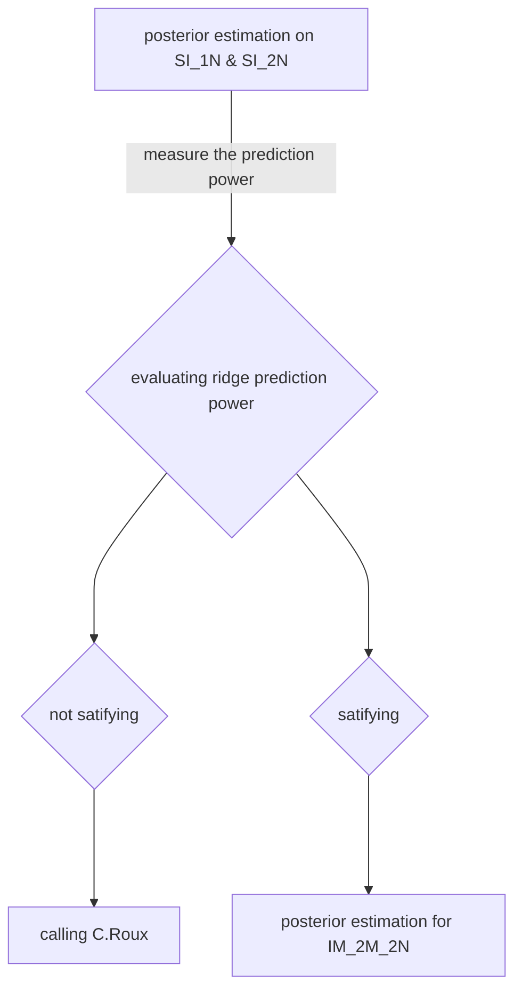

Tags : #Test
## Introduction
To estimate posterior, RIDGE use a script named : estimate_2pop_best.R, developed by C.Roux and modifyed by me. 
It mainly use a neural networt alghorithm from the package [nnet](https://cran.r-project.org/web/packages/nnet/index.html). Random forest from [[abcrf]]() were also used as a control. The main interest in using neural network is, it allows joint estimation of posterior, where random forest estimate each parameter separately.  

### Tests
We want to test the ability of estimate_2pop_best.R to estimate correctly the priors.
First we test for the simplest model (SI_1N and SI_2N, see [[demographic models to work with ABC]]), if estimate_2pop_best.R is able to 
get the parameter using simulated data from the same model used to generate the observed dataset
By default the priors used to generate the observed dataset are the following : 

|param|value|coalescent value|
|-----|-----|----|
|Tsplit| 10000 |0.0294|
|Na| 85000|1|
|N1| 85000|1|
|N2| 85000|1|
| $\mu$| 3e-8 | |
| $\frac{\rho}{\theta}$ | 5 ||
|locus length | 1000 bp|
In a second time, we want to caracterise the teh prediction power for model with migration and Ne heterogeneity (IM_2M_2N)

#### Plan of the test

#### Posterior estimation on SI_1N and SI_2N
For two models, a dataset of 1000 independent loci have been simulated. In other hand, the 4000 ABC datasets of 1000 loci were simulated for each models using the following prior bounds (in coalescent unit)
| param | lower bound | upper bound | ref value |
|--------|--------------|--------------| -------|
| Tsplit | 0.00294 | 0.058| 0.0294
| Na, N1, N2 | 0.1 | 2 | 1, 1, 1 |
| shape_N_a , shape_N_b | 0.1 | 5 | 4.36 , 1.77 |
posterior estiamition were done with 100 neural networks ( see why here [[Test performance estimation posterior#^598726]]) and in a second time with 1000 random trees from random forest to control if the results are dependant of the alghorithm. All the summary statistics where used (mode NULL [[Test performance estimation posterior#^4ab9d0]])
- Hypothesis 1 : Nnet does joint estimation, I expect it to have lower prediction power due to the cost of estimating all parameter at once. 
- Hypothesis 2 : SI_2N will be harder to predict than SI_1N, due to Ne heterogeneity 

##### Posterior estimation of SI_1N
![[SI_1N_posterior_estimation.jpg]]
**Fig 1** : *Posterior estimation of SI_1N model using nnet alghorithm (black line, mean = dashed line) and abcrf alghorithm (dashed blue line). The target value is the red solid line.*
The result show, similar performance for both of the algorithms based on their mean and the reference is always in the distribution of nnet posterior inference.  

##### Posterior estimation of SI_2N model

![[SI_2N_posterior_estimation.jpg]]
**Fig 2** : *Posterior estimation of SI_2N model. Legend is the same as Fig 1.* 

For the SI_2N model, the prediction power is lower than SI_1N (validate H2). Futhermore, the power of random forest seem significantly higher than nnet (validate H1 under H2). 
The beta shape parameter seems to be quite hard to predict. 

#### Contribution of each summary stats in estimation bias for SI_2N
##### rejection vs rejection + regression
Befole 
$D_S= \sqrt{\sum\limits_{I=1}^K (\theta_{I,S} - \theta_I)^2}$
With $D_S$, the euclidian distance betwen the obseved dataset and the simaluted dataset $S$. Where $\theta_I$ the value of the obseved set for the summary $Ieme$ summary statistic and $\theta_{I,S}$ the value of the summary stat $I$ for the simulated dataset $S$

![[SI_2N_reg_rej.jpg]]
**Fig 3** : 
## Improvements
- increase the quality and robustness of inferences from neural networks 
- make a better choice of variable use in neural networks

### Increasing the number of nnet and the size of it ^598726
Before my improvements, the default parameters were set up to ==10== neural networks (NN) and only 10 layers. The more neural networks there is, more robust are the results. 
With only 10 NN, the result were very random from one inference to another. So i increased it to various valuer (100,200,500,1000) and 200 NN seems to be a good compromise between robustness and computation time. For real use of RIDGE i’ll set up to 1000 NN (to be sure).

### The choice of variable use in NN ^4ab9d0

==trop tôt et trop intégré== 
To resume a dataset, RIDGE use various summary statistics (see [[Summary statistics use in ABC process]]). By default, DILS propose to remove all the pearson correlation and global joint sfs description (ss_noSf, ss_sf, noSs_sf, noSs_noSf). I tested various combination : 
- NULL : no variable are rejected 
- DILS : reject pearson + global sfs description (ss_noSf, ss_sf, noSs_sf, noSs_noSf)
- DILS_med : reject DiLS mode + median 
- CV : all the variable with a cv < 0.1 are rejected
- ALL : DILS mode + CV mode

![[fig/mse_posterior_estimate.pdf]]
**Fig 1** :e- normalised root mean square error (NRMSE) for each model to predict parameters 
(Tsplit,Na,N1,N2) of an IM_2M_2N model.
