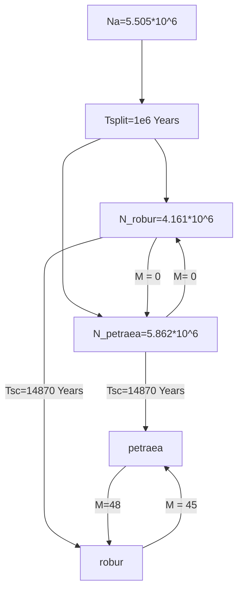

source vcf : Genomic structure and diversity of oak populations in British parklands [https://doi.org/10.1002/ppp3.10229](https://doi.org/10.1002/ppp3.10229). Data provide by Gabriele Nocchi

```mermaid
flowchart TB
A[Na=5.505*10^6] ---> B[Tsplit=1e6 Years]
B---> C[N_robur=4.161*10^6]
B---> D[N_petraea=5.862*10^6]
C---> | M = 0 | D
D ---> | M= 0| C
C---> |Tsc=14870 Years| robur
D---> |Tsc=14870 Years| petraea
robur ---> |M = 45| petraea
petraea ---> |M=48| robur

```
