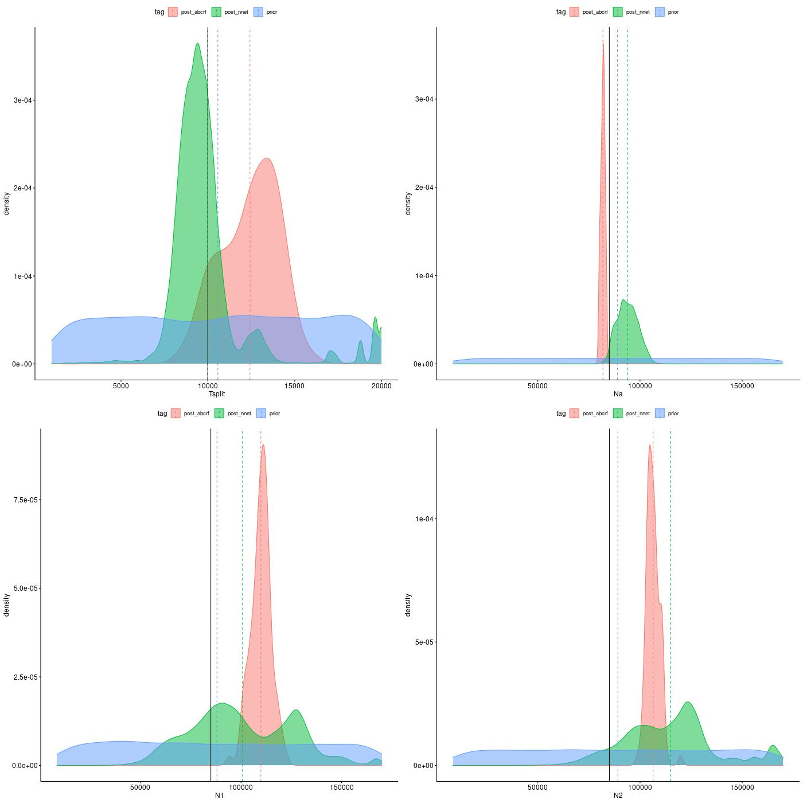
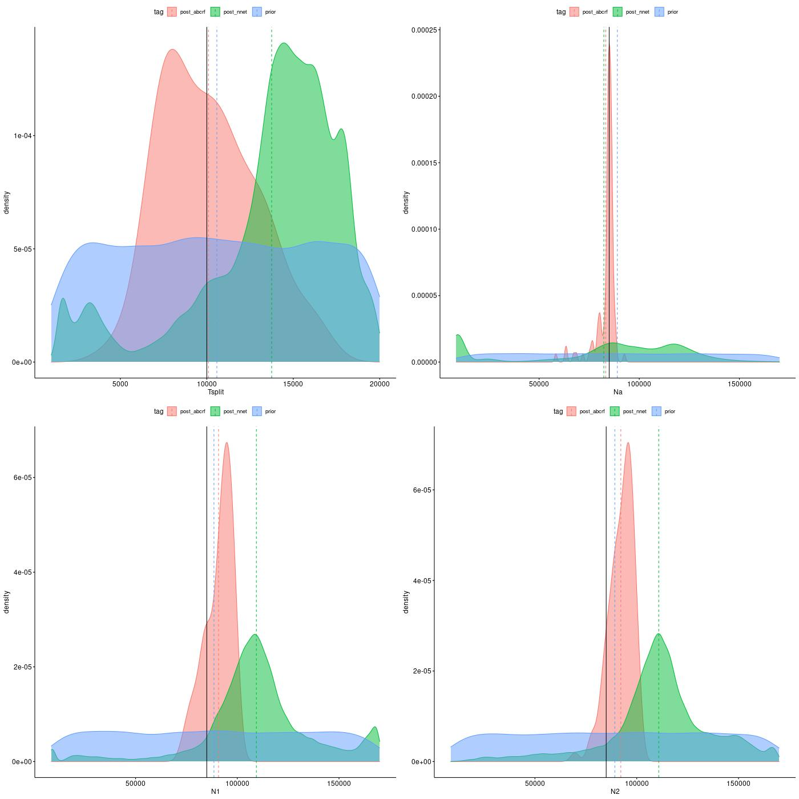

## Introduction
To estimate posterior, RIDGE use a script named : estimate_2pop_best.R, developed by C.Roux and modifyed by me. 
It mainly use a neural networt alghorithm from the package [nnet](https://cran.r-project.org/web/packages/nnet/index.html). Random forest from [[abcrf]]() were also used as a control. The main interest in using neural network is, it allows joint estimation of posterior, where random forest estimate each parameter separately. 

### Tests
We want to test the ability of estimate_2pop_best.R to estimate correctly the priors.
First we test for the simplest model (SI_1N and SI_2N) , if estimate_2pop_best.R is able to 
get the parameter using simulated data from the same model used to generate the observed dataset
By default the priors used to generate the observed dataset are the following : 

|param|value|coalescent value|
|-----|-----|----|
|Tsplit| 10000 |0.0294|
|Na| 85000|1|
|N1| 85000|1|
|N2| 85000|1|
| $\mu$| 3e-8 | |
| $\frac{\rho}{\theta}$ | 5 ||
|locus length | 1000 bp|
For each demographic model, 100 dataset where simulated and for SI_2N model, the heterogeneity of N was simulated usind a beta distribution with random paramater sampled between [0.1;5]. 

#### Posterior estimation on SI_1N and SI_2N
For two models, a dataset of 1000 independent loci have been simulated. In other hand, the 4000 ABC datasets of 1000 loci were simulated for each models using the following prior bounds (in coalescent unit)

##### SI_1N priors
| param | lower bound | upper bound | ref value |
|--------|--------------|--------------| -------|
| Tsplit | 0.00294 | 0.058| 0.0294
| Na, N1, N2 | 0.1 | 2 | 1, 1, 1 |

##### SI_2N Param priors

| param | lower bound | upper bound | ref value |
|--------|--------------|--------------| -------|
| Tsplit | 0.00294 | 0.058| 0.0294
| Na, N1, N2 | 0.1 | 2 | 1, 1, 1 |
| shape_N_a , shape_N_b | 0.1 | 5 |  |

posterior estiamition were done with 100 neural networks and in a second time with 1000 random trees from random forest to control if the results are dependant of the alghorithm. Nnet produce 1000 posteriors, where abcrf produce only one posterior estimation.  

- Hypothesis 1 : Nnet does joint estimation, I expect it to have lower prediction power due to the cost of estimating all parameter at once. 
- Hypothesis 2 : SI_2N will be harder to predict than SI_1N, due to Ne heterogeneity 

##### Posterior estimation of SI_1N

{width=100%}

The result show (cf Fig 1), similar performance for both of the algorithms based on their mean and the reference is always in the distribution of nnet posterior inference.  

##### Posterior estimation of SI_2N model

{width=100%}

The result show (cf Fig2), better performance for both random forest. Nnet tend to overestimate N1 and N2 values. More over, a bimodal distribution is observed for Na posterior through nnet. 

